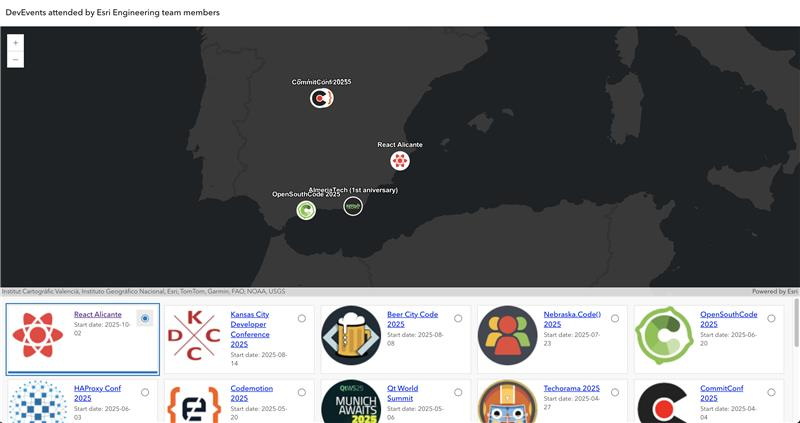

# devevents-map

This is just a simple map interface showing the DevEvents attended by Esri Engineering team members.

Data is hosted in [this ArcGIS Item](https://arcgis-devlabs.maps.arcgis.com/home/item.html?id=bf6fccd45e084a2fae0053ad534ffd8f#overview) ([raw JSON here](https://services3.arcgis.com/GVgbJbqm8hXASVYi/ArcGIS/rest/services/Esri_Developers_presence_at_events_view/FeatureServer/0/query?where=1%3D1&objectIds=&geometry=&geometryType=esriGeometryEnvelope&inSR=&spatialRel=esriSpatialRelIntersects&resultType=none&distance=0.0&units=esriSRUnit_Meter&relationParam=&returnGeodetic=false&outFields=*&returnGeometry=true&featureEncoding=esriDefault&multipatchOption=xyFootprint&maxAllowableOffset=&geometryPrecision=&outSR=&defaultSR=&datumTransformation=&applyVCSProjection=false&returnIdsOnly=false&returnUniqueIdsOnly=false&returnCountOnly=false&returnExtentOnly=false&returnQueryGeometry=false&returnDistinctValues=false&cacheHint=false&collation=&orderByFields=&groupByFieldsForStatistics=&outStatistics=&having=&resultOffset=&resultRecordCount=&returnZ=false&returnM=false&returnTrueCurves=false&returnExceededLimitFeatures=true&quantizationParameters=&sqlFormat=none&f=pgeojson&token=))

